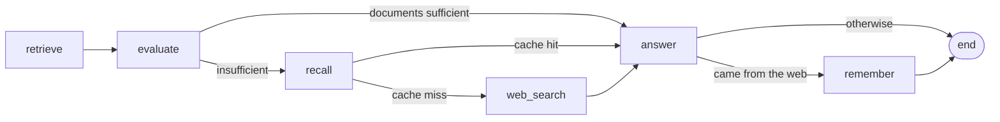

# Research Agent

A retrieval-augmented research agent for the video game industry, built as an explicit
state machine.

---

## How it works

Most question-answering assistants have one of two problems. Either they answer from
whatever the underlying language model happens to remember — which is fast, cheap and
occasionally confidently wrong — or they search the internet for everything, which is
accurate but slow and expensive.

This agent takes a third route: it tries the cheapest reliable source first, checks
whether the result is actually good enough, and only escalates when it is not.

A question travels through up to four stages:

1. **Look in the local knowledge base.** The agent holds a curated collection of verified
   records. It searches them by *meaning* rather than by keyword, so a question about
   "the first 3D Mario game" finds the right entry even though that exact phrase appears
   nowhere in the data.

2. **Judge the result before trusting it.** This is the step that distinguishes the agent
   from a conventional search tool. A similarity search always returns its closest
   matches — even when none of them is relevant. Ask about something absent from the
   collection and you still get results back, just wrong ones. So a second model reviews
   the retrieved records against the question and returns an explicit verdict: are these
   sufficient, yes or no? Only a "yes" is allowed to produce an answer.

3. **Check whether the question was answered before.** If the collection fell short, the
   agent consults its own memory of past answers. Anything it previously had to research
   is kept on disk, so the same question is never researched twice.

4. **Research it on the web.** Only if all of the above come up empty. The result is then
   written back to memory, so the cost is paid once rather than every time.

Whatever material the agent ends up with, the final answer is composed strictly from that
material — never from the model's own recollection. If the material does not contain the
answer, the agent says so rather than guessing.

### Why this design

**Answers are traceable.** Every response is grounded in a named source, and the agent
reports which one it used — the internal collection, its own memory, or a fresh web
search. There is no ambiguity about where a claim came from.

**The failure mode is silence, not fabrication.** The explicit judging step is what
prevents the classic quiet failure of retrieval systems: a fluent, plausible answer
assembled from documents that had nothing to do with the question.

**Cost and latency scale with difficulty.** Easy questions never touch the internet.
Repeated hard questions never touch it twice. In practice a question answered from the
local collection completes in roughly five seconds; one requiring live research takes
around twelve, and only the first time it is asked.

**Behaviour is predictable and testable.** The route through the pipeline is decided by
explicit rules, not by the language model choosing its own next action. The same question
therefore takes the same route every time, that route is recorded, and it can be asserted
on in tests — which means a regression in the agent's *reasoning* is caught as an ordinary
test failure rather than discovered in production.

### Where this applies

The video game collection shipped here is an illustrative dataset. The pattern itself
suits any situation where an organisation holds authoritative internal information that
must take precedence over both public sources and a model's general knowledge:

- **Customer and technical support** — answer from the internal knowledge base first, fall
  back to public documentation, and cache whatever had to be researched.
- **Regulated and policy-bound domains** — where an answer must cite an approved internal
  source, and "I could not find this" is a valid and necessary outcome.
- **Internal expertise lookup** — product specifications, contract terms, operational
  runbooks: material that is authoritative, changes slowly, and is expensive to research
  from scratch each time.
- **Any workload with a long tail of repeated questions**, where the cache converts a
  recurring research cost into a one-off one.

---

## Architecture

Five tools, wired as the nodes of one state machine. Three conditions decide which nodes
actually run.



| Node | Tool | Responsibility |
|------|------|----------------|
| `retrieve` | `retrieve_game` | Similarity search over the local collection |
| `evaluate` | `evaluate_retrieval` | LLM judge; returns a structured `useful` verdict |
| `recall` | `search_memory` | Look for a cached answer to the same question |
| `web_search` | `game_web_search` | Live web research via Tavily |
| `answer` | — | Compose the final answer from whatever grounding was collected |
| `remember` | `register_memory` | Cache an answer that cost a web search |

Long-term memory sits on the path to the web deliberately: it is consulted only when the
collection cannot answer, and written only when the web actually had to be called. An
answer served from the cache is therefore never written back to it.

The language model never selects the route — `evaluate_retrieval` and the cache lookup do,
and the route taken is recorded in `run.snapshots`.

A question answered from the collection costs two model calls (judge and answer) plus one
embedding.

---

## Requirements

- Python 3.11 or newer
- An OpenAI API key (chat completions and embeddings)
- A Tavily API key (web search)

## Installation

```bash
git clone <repository-url>
cd multi-agent-RAG-games

# with uv (recommended)
uv venv
uv pip install -e ".[dev]"

# or with pip
python -m venv .venv
.venv/bin/pip install -e ".[dev]"      # Windows: .venv\Scripts\pip
```

## Configuration

Copy the example file and fill in your keys:

```bash
cp .env.example .env
```

```ini
OPENAI_API_KEY="sk-..."
TAVILY_API_KEY="tvly-..."

# Optional. Only needed if your OpenAI access goes through a proxy that gives
# you a different base URL. Leave it out entirely when using api.openai.com.
# OPENAI_BASE_URL="https://..."
```

`.env` is gitignored and must never be committed. Keys are resolved once, at startup, by
`Settings.from_env()`; a missing key fails immediately with a clear message rather than
surfacing later as an authentication error in the middle of a run.

## Usage

### Build the index (required once, before anything else)

```bash
research-agent --build-index
```

Reads every JSON file in `data/games/`, embeds it, and writes the collection to
`chromadb/`. The operation is idempotent — re-running it refreshes existing entries rather
than failing on duplicates, so you can edit a source file and rebuild without cleaning up
first.

### Ask a single question

```bash
research-agent "What is the genre of Halo Infinite?"
```

```
path  : retrieve -> evaluate -> answer
Halo Infinite is a first-person shooter.
```

Add `--quiet` to print only the answer, which is what you want when piping the output into
another program.

### Interactive mode

```bash
research-agent
```

The no-argument default. Each answer is followed by the source it came from. Type `quit`
or press Ctrl-C to exit.

### Run the evaluation suite

```bash
research-agent --evaluate
```

Exits `0` if every case took its expected route, `1` otherwise. See
[Evaluation](#evaluation) below.

### Use it as a library

```python
from research_agent import build_application

app = build_application()
run = app.agent.invoke("What is the genre of Halo Infinite?")

print(run.get_final_state()["answer"])
print(app.agent.path_of(run))     # ['retrieve', 'evaluate', 'answer']
```

Nothing in the package opens a database connection or an API client at import time.
Everything is constructed in `build_application`, which means importing any module is
free, credential errors happen in one predictable place, and a test can build a second,
fully independent application against a different database.

---

## Project structure

```
src/research_agent/
├── app.py            Composition root: settings in, wired Application out
├── cli.py            Command line entry point
├── config.py         Settings, resolved once from the environment
├── indexer.py        Builds the game collection from data/games/
├── tools.py          The five tools, bound to their clients
├── workflow.py       ResearchAgent: the tools wired as a state machine
├── cache.py          The web-answer cache
├── evaluation.py     Evaluation suite: route checking and answer scoring
├── http_patch.py     Retry workaround for an unreliable OpenAI proxy
└── framework/        Reusable, domain-agnostic building blocks
    ├── state_machine.py   Steps, transitions, runs, snapshots
    ├── llm.py             Thin OpenAI chat wrapper
    ├── vector_db.py       Typed wrapper over a ChromaDB collection
    ├── memory.py          LongTermMemory over a vector store
    ├── rag.py             Self-contained retrieve-augment-generate pipeline
    ├── documents.py       Document and Corpus
    ├── messages.py        System / User / AI messages
    ├── parsers.py         Pydantic output parsing
    ├── evaluation.py      LLM-as-a-judge scoring
    └── tooling.py         Function-to-tool wrapper
```

`framework/` contains nothing specific to video games; `research_agent/` is the
application built on top of it.

## Data format

One JSON file per game in `data/games/`. The filename stem becomes the document id, so
re-indexing updates a record instead of duplicating it.

```json
{
  "Name": "Super Mario 64",
  "Platform": "Nintendo 64",
  "Genre": "Platformer",
  "Publisher": "Nintendo",
  "Description": "A groundbreaking 3D platformer that set new standards for the genre.",
  "YearOfRelease": 1996
}
```

`Name`, `Platform`, `Genre`, `YearOfRelease` and `Description` are required; the indexer
raises and names the offending file if one is missing, rather than quietly indexing a
half-empty record. `Publisher` is stored as metadata.

Platform, genre, name, year and description are bundled into a single indexed line, so a
question phrased around any of them has something to match on.

## Configuration reference

Every field of `Settings` can be overridden by keyword in code; a subset is also exposed
on the command line.

| Setting | Default | Purpose |
|---------|---------|---------|
| `model` | `gpt-4o-mini` | Chat model used by every LLM role |
| `chroma_path` | `chromadb` | Persistent database directory (`--chroma-path`) |
| `games_path` | `data/games` | Source JSON directory, read by the indexer |
| `collection_name` | `udaplay` | Collection holding the indexed games |
| `memory_collection` | `long_term_memory` | Collection holding the web-answer cache |
| `memory_owner` | `player` | Owner label every cache entry is stored under |
| `memory_namespace` | `research` | Namespace label, isolating these entries |
| `cache_ttl_days` | `30` | How long a cached web answer stays trustworthy |
| `cache_hit_distance` | `0.12` | Maximum embedding distance still counted as the same question |
| `retrieval_results` | `3` | Documents returned by a collection search |
| `max_web_results` | `5` | Results requested per web search |
| `snippet_chars` | `300` | How much of each web result's text is kept |
| `answer_temperature` | `0.2` | Temperature for the answer step; the judge is fixed at `0.0` |

```python
from research_agent import build_application
from research_agent.config import Settings

app = build_application(Settings.from_env(retrieval_results=5, cache_ttl_days=7))
```

---

## Development

```bash
pytest                      # routing tests: offline, no keys, no cost
ruff check src tests
```

The test suite uses stub tools, so it runs in milliseconds and costs nothing. That is
deliberate: routing is the part most likely to break during a refactor, whereas the
end-to-end evaluation needs network, keys and about a minute.

`OfflineAgent` overrides `_answer` by subclassing rather than by patching the attribute —
`_create_state_machine` binds the node methods at construction time, so assigning
`agent._answer` afterwards would leave the already-wired node pointing at the original.

## Evaluation

`research-agent --evaluate` runs five cases chosen so that between them they force the
pipeline down every route: three the collection can answer, one it cannot, and then that
same unanswerable question a second time — which should now be served from the cache
without touching the internet. Asking it twice is the point; it is what demonstrates the
cache is doing its job.

Each case is scored two ways:

- **Route** — a strict comparison against the expected node path. The route is meant to be
  deterministic; if it changes, something is genuinely broken.
- **Answer quality** — graded by a separate model against a reference answer.

Only the route determines the exit code. Two of the cases depend on whatever the live web
returns that minute, so gating the build on their answer scores would fail at random.

The cache is cleared before the suite runs. Without that, the cache-miss case would find
the previous run's answer, take the cache-hit route, and silently stop testing anything.

## Known limitations

- **The proxy retry workaround is inert on `openai` 3.x.** `http_patch.py` patches
  `httpx.Client.send`, but `openai` 3.x routes its traffic through the separate `httpx2`
  package. The patch installs cleanly and has no effect. It matters only when running
  behind a proxy that returns HTML error pages; against `api.openai.com` it is
  unnecessary.
- **`--build-index` runs without that workaround** in any case, as it executes before the
  application — and therefore the patch — is constructed.
- **Unsuccessful answers are cached.** A question that reaches the web and still cannot be
  answered is written to the cache alongside successful ones, and stays there for
  `cache_ttl_days`.
- **`Publisher` is not searchable.** It is stored as metadata but not included in the
  indexed text, and metadata is not passed to the answer step.
- **`cache_hit_distance` is coupled to the collection's distance metric,** which is left at
  ChromaDB's default. Changing the metric silently invalidates the threshold.
- **The evaluation suite is order-dependent**: the cache-hit case relies on the cache-miss
  case having run before it.

## License

Apache License 2.0 — see [LICENSE](LICENSE).
